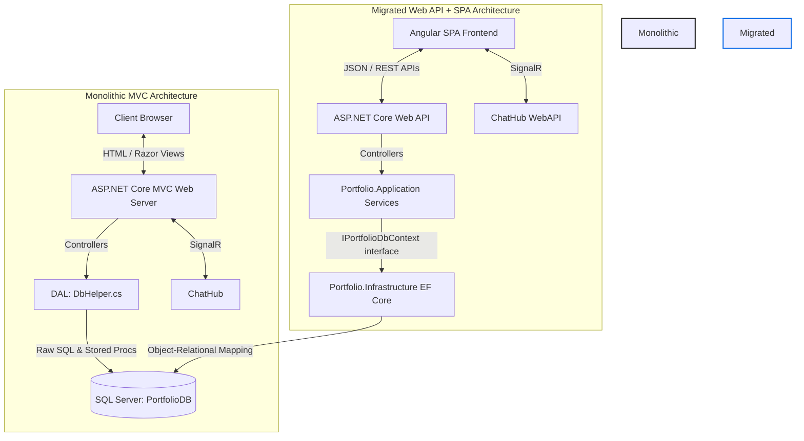
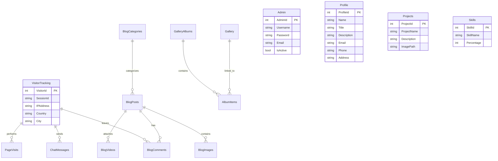

# Portfolio Management System: Codebase Analysis & Migration Report

This report provides a comprehensive technical analysis of the **Portfolio Management System** codebase. The repository contains two distinct architectures of the same application:
1. **Monolithic ASP.NET Core MVC Application** (located in the root `/Portfolio Management System` folder).
2. **Decoupled Single Page Application (SPA) & Web API Architecture** (located in `/asp.netcore/backend` and `/asp.netcore/frontend`).

---

## 1. System Architecture Overview

The system is a fully-featured professional portfolio application supporting profiles, project show-casing, education, experiences, skills, visitor/resume tracking, blog category management with posts/likes/images/comments/videos, and real-time chat between visitors and the administrator.

Below is an architectural diagram mapping the two parallel implementations:

---

## 2. Key Architectural Comparisons

The codebase demonstrates a transition from a traditional monolithic MVC pattern to a decoupled, clean-architecture backend with a client-side frontend framework.

| Architectural Component | Monolithic MVC Application (`/Portfolio Management System`) | Decoupled API + SPA (`/asp.netcore`) |
| :--- | :--- | :--- |
| **Frontend Rendering** | Server-Side Rendering (Razor Views `.cshtml`) | Client-Side Rendering (Angular SPA running on port `4200`) |
| **API Boundary** | Controllers return `IActionResult` rendering views or redirecting | Controllers return JSON (`ApiController` inheriting from `ControllerBase`) |
| **Data Access Layer** | Custom `DbHelper` utilizing ADO.NET (`Microsoft.Data.SqlClient`) with inline SQL and Stored Procedures | EF Core (`DbContext` mapping) using Fluent API and LINQ queries |
| **Session & Auth** | Cookie Session (`.Portfolio.Session` cookie with 30-min idle timeout) | Stateless JWT Bearer Token (validated via Symmetric Security Keys) |
| **Business Logic** | Embedded inside controllers and helper classes | Separated into `Portfolio.Application` services |
| **Dependency Injection** | Scoped `DbHelper`, `EmailService` configured in `Program.cs` | Tiered DI in `DependencyInjection.cs` across Application, Infrastructure, and WebAPI layers |
| **Real-time Engine** | SignalR `ChatHub` mapped to `/chathub` with session tracking | SignalR `ChatHub` supporting JWT token retrieval from query string |

---

## 3. Database Schema Analysis

The database consists of **21 tables** representing the application domain. The relational structure handles content delivery (portfolio, blog, gallery) as well as operational analytics (visitor tracking, page visits, resume views).

### Key Table Entities & Relationships

### Stored Procedures vs. EF Core Entity Mappings
In the SQL script (`script_utf8.sql`), a complete suite of stored procedures is defined to support CRUD operations in the MVC system. 
For example:
- `sp_AddAdmin`
- `sp_AddBlogCategory`
- `sp_AddBlogComment`
- `sp_AddBlogPost`
- `sp_AddEducation`
- `sp_AddExperience`

In the new Clean Architecture setup, these procedures are replaced by Entity Framework Core DbSet entities configured inside [PortfolioDbContext.cs](file:///d:/Asp.net%20core_Project/Portfolio%20Management%20Systembyalok/asp.netcore/backend/src/Portfolio.Infrastructure/Data/PortfolioDbContext.cs), mapped to matching database tables via EF Fluent API (e.g. `modelBuilder.Entity<Admin>().ToTable("Admin")`).

---

## 4. Codebase Structural Breakdown

### A. Monolithic MVC Project
*   **[Program.cs](file:///d:/Asp.net%20core_Project/Portfolio%20Management%20Systembyalok/Portfolio%20Management%20System/Program.cs)**: Standard host configuration, session configuration, dependency lifetimes, directory creation, routing setup.
*   **`DAL/`**: Contains the ADO.NET helper [DbHelper.cs](file:///d:/Asp.net%20core_Project/Portfolio%20Management%20Systembyalok/Portfolio%20Management%20System/DAL/DbHelper.cs) which executes raw SQL against SQL Server.
*   **`Controllers/`**: Traditional MVC controllers returning View models:
    *   `HomeController`: Manages front-facing portfolio pages.
    *   `AdminController`: Large admin controller validating admin login, managing resume views, skills, projects, and experiences via session verification.
    *   `BlogController` & `AdminBlogController`: Guest blog viewing and admin blog authoring.
    *   `GalleryController` & `AdminGalleryController`: Gallery/Album viewing and uploading.
*   **`Views/`**: Razor view templates (`.cshtml`) paired with layout pages and partials.

### B. Clean Architecture Backend (`asp.netcore/backend`)
Designed using Clean Architecture separation of concerns:
*   **`Portfolio.Domain`**: Completely isolated project containing POCO classes (e.g. [Admin.cs](file:///d:/Asp.net%20core_Project/Portfolio%20Management%20Systembyalok/asp.netcore/backend/src/Portfolio.Domain/Entities/Admin.cs), [BlogPost.cs](file:///d:/Asp.net%20core_Project/Portfolio%20Management%20Systembyalok/asp.netcore/backend/src/Portfolio.Domain/Entities/BlogPost.cs)) and models. No external dependencies.
*   **`Portfolio.Application`**: Declares application service interfaces, DTOs, and contains application service implementations:
    *   `Services/`: [BlogService.cs](file:///d:/Asp.net%20core_Project/Portfolio%20Management%20Systembyalok/asp.netcore/backend/src/Portfolio.Application/Services/BlogService.cs), [DashboardService.cs](file:///d:/Asp.net%20core_Project/Portfolio%20Management%20Systembyalok/asp.netcore/backend/src/Portfolio.Application/Services/DashboardService.cs), [GalleryService.cs](file:///d:/Asp.net%20core_Project/Portfolio%20Management%20Systembyalok/asp.netcore/backend/src/Portfolio.Application/Services/GalleryService.cs), [PortfolioService.cs](file:///d:/Asp.net%20core_Project/Portfolio%20Management%20Systembyalok/asp.netcore/backend/src/Portfolio.Application/Services/PortfolioService.cs).
*   **`Portfolio.Infrastructure`**: Implementation details including:
    *   `Data/`: [PortfolioDbContext.cs](file:///d:/Asp.net%20core_Project/Portfolio%20Management%20Systembyalok/asp.netcore/backend/src/Portfolio.Infrastructure/Data/PortfolioDbContext.cs) mapping entities to database.
    *   `Services/`: TokenService (JWT generation) and EmailService implementations.
*   **`Portfolio.WebAPI`**: Presentation layer containing REST-based controllers, CORS configurations, Swagger docs, and Token/Session authentication hooks.

### C. Angular SPA Frontend (`asp.netcore/frontend`)
*   **`src/app/services/`**: Angular HTTP client wrappers interfacing directly with Web API endpoints (e.g. `PortfolioService`, `BlogService`, `AuthService`).
*   **`src/app/components/public/`**: User-facing modules including Home (profile display, skills progress bars, project list), Blog (list, search, detail view), Resume download page, and real-time Chat widget.
*   **`src/app/components/admin/`**: Admin portal managing experience, education, projects, skills, and visitor analytics.
*   **`src/app/guards/`**: Angular guards (such as `AuthGuard`) protecting administration routes using JWT verification.

---

## 5. Summary of Architectural Strengths

1.  **Strict Separation of Concerns**: In the new structure, domain objects are cleanly separated from data access and presentation. The Web API layer functions purely as a headless service.
2.  **Scalable State Management**: Stateless authentication (JWT) avoids memory overhead of cookie sessions on the server, permitting high horizontal scaling of the API backend.
3.  **Modern Interactivity**: Angular frontend provides high responsive rendering and single-page routing, reducing network traffic and eliminating full-page server reloads.
4.  **Real-Time Analytics**: Built-in Visitor tracking engines log session data, IP addresses, geolocations, page visits, and resume download behaviors, feeding a real-time admin analytics dashboard.
